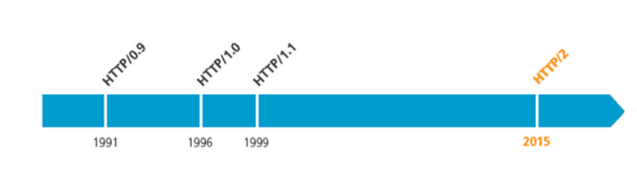
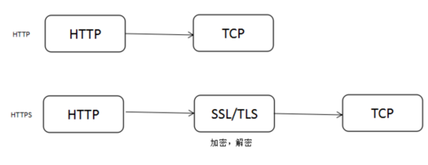
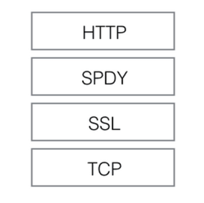
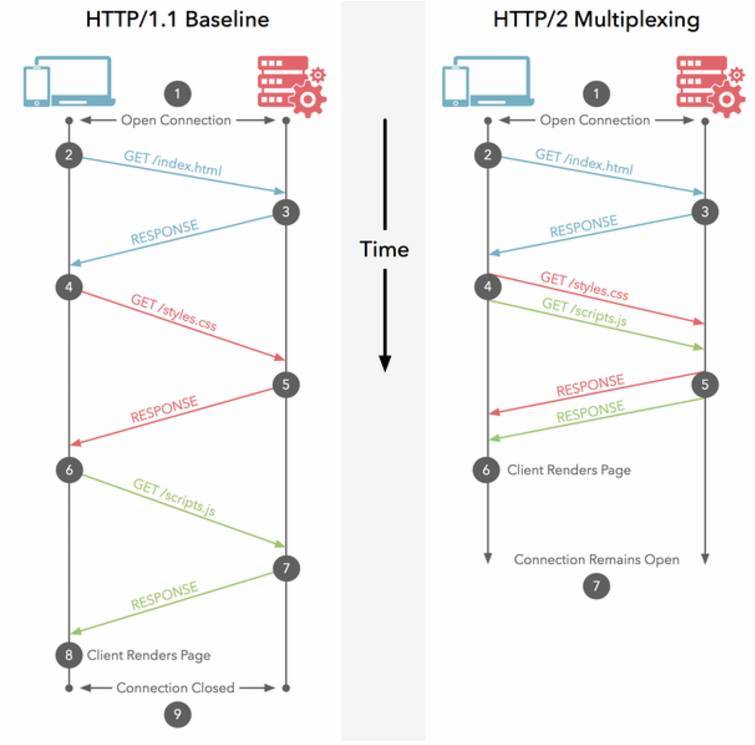
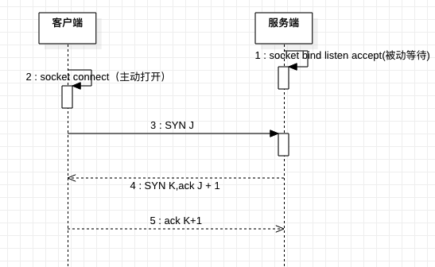
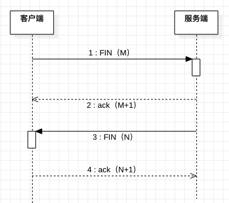
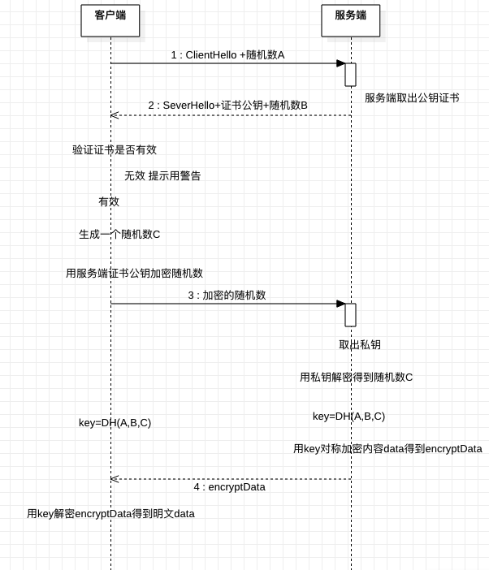

#  https two-way authentication（https双向验证）

## 1.http演进

### 1.1 http1.0  http1.1  http2.0 https
>  参考：https://www.cnblogs.com/heluan/p/8620312.html

#### 1.1.1 http的历史

>  早在 HTTP 建立之初，主要就是为了将超文本标记语言(HTML)文档从Web服务器传送到客户端的浏览器。HTML页面放在 web 服务器上，用户端通过浏览器访问url地址来获取网页的显示内容，但是到了 WEB2.0 以来，我们的页面变得复杂，不仅仅单纯的是一些简单的文字和图片，同时我们的 HTML 页面有了 CSS，Javascript，来丰富我们的页面展示，当 ajax 的出现，我们又多了一种向服务器端获取数据的方法，这些其实都是基于 HTTP 协议的。同样到了移动互联网时代，我们页面可以跑在手机端浏览器里面，但是和 PC 相比，手机端的网络情况更加复杂，这使得我们开始了不得不对 HTTP 进行深入理解并不断优化过程中。

>  

####  1.1.2 HTTP的基本优化

> 影响一个 HTTP 网络请求的因素主要有两个：带宽和延迟。

> 带宽：如果说我们还停留在拨号上网的阶段，带宽可能会成为一个比较严重影响请求的问题，但是现在网络基础建设已经使得带宽得到极大的提升，我们不再会担心由带宽而影响网速，那么就只剩下延迟了。

> 延迟：

> + 浏览器阻塞（HOL blocking）：浏览器会因为一些原因阻塞请求。浏览器对于同一个域名，同时只能有 4 个连接（这个根据浏览器内核不同可能会有所差异），超过浏览器最大连接数限制，后续请求就会被阻塞。

> + DNS 查询（DNS Lookup）：浏览器需要知道目标服务器的 IP 才能建立连接。将域名解析为 IP 的这个系统就是 DNS。这个通常可以利用DNS缓存结果来达到减少这个时间的目的。

> + 建立连接（Initial connection）：HTTP 是基于 TCP 协议的，浏览器最快也要在第三次握手时才能捎带 HTTP 请求报文，达到真正的建立连接，但是这些连接无法复用会导致每次请求都经历三次握手和慢启动。三次握手在高延迟的场景下影响较明显，慢启动则对文件类大请求影响较大。

####  1.1.3 HTTP1.0和HTTP1.1的一些区别

> HTTP1.0最早在网页中使用是在1996年，那个时候只是使用一些较为简单的网页上和网络请求上，而HTTP1.1则在1999年才开始广泛应用于现在的各大浏览器网络请求中，同时HTTP1.1也是当前使用最为广泛的HTTP协议。 主要区别主要体现在：

> + 缓存处理，在HTTP1.0中主要使用header里的If-Modified-Since,Expires来做为缓存判断的标准，HTTP1.1则引入了更多的缓存控制策略例如Entity tag，If-Unmodified-Since, If-Match, If-None-Match等更多可供选择的缓存头来控制缓存策略。

> + 带宽优化及网络连接的使用，HTTP1.0中，存在一些浪费带宽的现象，例如客户端只是需要某个对象的一部分，而服务器却将整个对象送过来了，并且不支持断点续传功能，HTTP1.1则在请求头引入了range头域，它允许只请求资源的某个部分，即返回码是206（Partial Content），这样就方便了开发者自由的选择以便于充分利用带宽和连接。

> + 错误通知的管理，在HTTP1.1中新增了24个错误状态响应码，如409（Conflict）表示请求的资源与资源的当前状态发生冲突；410（Gone）表示服务器上的某个资源被永久性的删除。

> + Host头处理，在HTTP1.0中认为每台服务器都绑定一个唯一的IP地址，因此，请求消息中的URL并没有传递主机名（hostname）。但随着虚拟主机技术的发展，在一台物理服务器上可以存在多个虚拟主机（Multi-homed Web Servers），并且它们共享一个IP地址。HTTP1.1的请求消息和响应消息都应支持Host头域，且请求消息中如果没有Host头域会报告一个错误（400 Bad Request）。

> + 长连接，HTTP 1.1支持长连接（PersistentConnection）和请求的流水线（Pipelining）处理，在一个TCP连接上可以传送多个HTTP请求和响应，减少了建立和关闭连接的消耗和延迟，在HTTP1.1中默认开启Connection： keep-alive，一定程度上弥补了HTTP1.0每次请求都要创建连接的缺点。

####  1.1.4 HTTPS与HTTP的一些区别

> + HTTPS协议需要到CA申请证书，一般免费证书很少，需要交费。

> + HTTP协议运行在TCP之上，所有传输的内容都是明文，HTTPS运行在SSL/TLS之上，SSL/TLS运行在TCP之上，所有传输的内容都经过加密的。

> + HTTP和HTTPS使用的是完全不同的连接方式，用的端口也不一样，前者是80，后者是443。

> + HTTPS可以有效的防止运营商劫持，解决了防劫持的一个大问题。

####  1.1.5  SPDY：HTTP1.x的优化

>  2012年google如一声惊雷提出了SPDY的方案，优化了HTTP1.X的请求延迟，解决了HTTP1.X的安全性，具体如下：

> + 降低延迟，针对HTTP高延迟的问题，SPDY优雅的采取了多路复用（multiplexing）。多路复用通过多个请求stream共享一个tcp连接的方式，解决了HOL blocking的问题，降低了延迟同时提高了带宽的利用率。

> + 请求优先级（request prioritization）。多路复用带来一个新的问题是，在连接共享的基础之上有可能会导致关键请求被阻塞。SPDY允许给每个request设置优先级，这样重要的请求就会优先得到响应。比如浏览器加载首页，首页的html内容应该优先展示，之后才是各种静态资源文件，脚本文件等加载，这样可以保证用户能第一时间看到网页内容。

> + header压缩。前面提到HTTP1.x的header很多时候都是重复多余的。选择合适的压缩算法可以减小包的大小和数量。

> + 基于HTTPS的加密协议传输，大大提高了传输数据的可靠性。

> + 服务端推送（server push），采用了SPDY的网页，例如我的网页有一个sytle.css的请求，在客户端收到sytle.css数据的同时，服务端会将sytle.js的文件推送给客户端，当客户端再次尝试获取sytle.js时就可以直接从缓存中获取到，不用再发请求了。SPDY构成图：

>  

>  SPDY位于HTTP之下，TCP和SSL之上，这样可以轻松兼容老版本的HTTP协议(将HTTP1.x的内容封装成一种新的frame格式)，同时可以使用已有的SSL功能。

####  1.1.6  HTTP2.0：SPDY的升级版

>  HTTP2.0可以说是SPDY的升级版（其实原本也是基于SPDY设计的），但是，HTTP2.0 跟 SPDY 仍有不同的地方，如下：

>  HTTP2.0和SPDY的区别：

> + HTTP2.0 支持明文 HTTP 传输，而 SPDY 强制使用 HTTPS

> + HTTP2.0 消息头的压缩算法采用 HPACK http://http2.github.io/http2-spec/compression.html，而非 SPDY 采用的 DEFLATE http://zh.wikipedia.org/wiki/DEFLATE

 

####  1.1.7  HTTP2.0和HTTP1.X相比的新特性

> + 新的二进制格式（Binary Format），HTTP1.x的解析是基于文本。基于文本协议的格式解析存在天然缺陷，文本的表现形式有多样性，要做到健壮性考虑的场景必然很多，二进制则不同，只认0和1的组合。基于这种考虑HTTP2.0的协议解析决定采用二进制格式，实现方便且健壮。

> + 多路复用（MultiPlexing），即连接共享，即每一个request都是是用作连接共享机制的。一个request对应一个id，这样一个连接上可以有多个request，每个连接的request可以随机的混杂在一起，接收方可以根据request的 id将request再归属到各自不同的服务端请求里面。

> + header压缩，如上文中所言，对前面提到过HTTP1.x的header带有大量信息，而且每次都要重复发送，HTTP2.0使用encoder来减少需要传输的header大小，通讯双方各自cache一份header fields表，既避免了重复header的传输，又减小了需要传输的大小。

> + 服务端推送（server push），同SPDY一样，HTTP2.0也具有server push功能。

 

####  1.1.8 HTTP2.0的升级改造

前文说了HTTP2.0其实可以支持非HTTPS的，但是现在主流的浏览器像chrome，firefox表示还是只支持基于 TLS 部署的HTTP2.0协议，所以要想升级成HTTP2.0还是先升级HTTPS为好。

当你的网站已经升级HTTPS之后，那么升级HTTP2.0就简单很多，如果你使用NGINX，只要在配置文件中启动相应的协议就可以了，可以参考NGINX白皮书，NGINX配置HTTP2.0官方指南 https://www.nginx.com/blog/nginx-1-9-5/。

使用了HTTP2.0那么，原本的HTTP1.x怎么办，这个问题其实不用担心，HTTP2.0完全兼容HTTP1.x的语义，对于不支持HTTP2.0的浏览器，NGINX会自动向下兼容的。

 

####  1.1.9  附注

> HTTP2.0的多路复用和HTTP1.X中的长连接复用有什么区别？

> + HTTP/1.* 一次请求-响应，建立一个连接，用完关闭；每一个请求都要建立一个连接；

> + HTTP/1.1 Pipeling解决方式为，若干个请求排队串行化单线程处理，后面的请求等待前面请求的返回才能获得执行机会，一旦有某请求超时等，后续请求只能被阻塞，毫无办法，也就是人们常说的线头阻塞；

> + HTTP/2多个请求可同时在一个连接上并行执行。某个请求任务耗时严重，不会影响到其它连接的正常执行；
> + 具体如图：

>  

> + 为什么需要头部压缩？
>>  假定一个页面有100个资源需要加载（这个数量对于今天的Web而言还是挺保守的）, 而每一次请求都有1kb的消息头（这同样也并不少见，因为Cookie和引用等东西的存在）, 则至少需要多消耗100kb来获取这些消息头。HTTP2.0可以维护一个字典，差量更新HTTP头部，大大降低因头部传输产生的流量。具体参考：HTTP/2 头部压缩技术介绍

 

> +  HTTP2.0多路复用有多好？
>> HTTP 性能优化的关键并不在于高带宽，而是低延迟。TCP 连接会随着时间进行自我「调谐」，起初会限制连接的最大速度，如果数据成功传输，会随着时间的推移提高传输的速度。这种调谐则被称为 TCP 慢启动。由于这种原因，让原本就具有突发性和短时性的 HTTP 连接变的十分低效。
>> HTTP/2 通过让所有数据流共用同一个连接，可以更有效地使用 TCP 连接，让高带宽也能真正的服务于 HTTP 的性能提升。

### 1.2 TCP协议建立和释放连接
#### 1.2.1 TCP的三次握手
TCP通过三次握手，建立连接
>  
> + 第一次握手：客户端向服务端发起连接请求，服务端收到信息，知道客服端发送信息邮路是通的。
> + 第二次握手：服务端向客户端响应信息，告诉客户端，我收到了你端信息，客户端接收到服务端端信息，就知道了服务端到客户端的邮路是通的。
> + 第三次握手：如果不做第三次握手，哪服务端不知道第二次握手信息客户端是否收到，所以需要第三次握手，客户端告诉服务端，你响应的消息我收到了。

>  这个过程，类似我们在信号不好的时候打电话的过程：

>  - “喂，能听到我说话吗”

>  - “我能听到，你能听到我吗”

>  - “能听到”

#### 1.2.2 TCP的四次挥手（断开连接）
 TCP通过四次挥手，断开连接
 >  
> +  第一步：客户端发送FIN（M）报文给服务器，告诉对方，“我的数据发完了”。
 
> +  第二步：服务器收到FIN（M）报文后，回给客户端一个ack（M+1）报文，告诉客户端，“好，我知道了”。
 
> +  第三步：服务器发一个FIN（N）报文给客户端，告诉对方，“我的数据也发完了”。
 
> +  第四步：客户端回应ack（N+1）,告诉服务器，“好，我知道了”，至此，连接结束。
 
 这个过程类似两个人打完电话的结束过程。
 
> +  A:我说完了
 
> +  B:哦
 
>  B想了一下，也没什么要说的
 
> +  B:我也说完了
 
> +  A:好
 
> 通话结束，双方挂电话
   

## 2.https单边验证
>  参考：https://www.jianshu.com/p/119c4dbb7225
>  

> + 第一步：客户端发起ClientHello

客户端向指定域名的服务器发起https请求，请求内容包括:

+ 1）客户端支持的SSL/TLS协议版本列表

+ 2）支持的对称加密算法列表

+ 3）客户端生成的随机数A

> + 第二步：服务端回应SeverHello

服务器收到请求后，回应客户端，回应的内容主要有：

+ 1）SSL/TLS版本。服务器会在客户端支持的协议和服务器自己支持的协议中，选择双方都支持的SSL/TLS的最高版本，作为双方使用的SSL/TLS版本。如果客户端的SSL/TLS版本服务器都不支持，则不允许访问

+ 2）与1类似，选择双方都支持的最安全的加密算法。

+ 3）从服务器密钥库中取出的证书

+ 4）服务器端生成的随机数B

> + 第三步：客户端回应

客户端收到后，检查证书是否合法，主要检查下面4点：

+ 1)、检查证书是否过期

+ 2)、检查证书是否已经被吊销。

有CRL和OCSP两种检查方法。CRL即证书吊销列表，证书的属性里面会有一个CRL分发点属性，如下图所示（CSDN的证书），这个属性会包含了一个url地址，证书的签发机构会将被吊销的证书列表展现在这个url地址中；OCSP是在线证书状态检查协议，客户端直接向证书签发机构发起查询请求以确认该证书是否有效。

+ 3)、证书是否可信。

客户端会有一个信任库，里面保存了该客户端信任的CA（证书签发机构）的证书，如果收到的证书签发机构不在信任库中，则客户端会提示用户证书不可信。

若客户端是浏览器，各个浏览器都会内置一些可信任的证书签发机构列表，在浏览器的设置中可以看到。

如果不在信任表中，则浏览器会出现类似下面的警告页面，提示你不安全。（当然，你可以选择继续访问）

若客户端是程序，例如Java中，需要程序配置信任库文件，以判断证书是否可信，如果没设置，则默认使用jdk自带的证书库（jre\lib\security\cacerts,默认密码changeit）。如果证书或签发机构的证书不在信任库中，则认为不安全，程序会报错。（你可以在程序中设置信任所有证书，不过这样并不安全）。

+ 4)、检查收到的证书中的域名与请求的域名是否一致。

若客户端是程序，这一项可配置不检查。若为浏览器，则会出现警告，用户也可以跳过。

证书验证通过后，客户端使用特定的方法又生成一个随机数c，这个随机数有专门的名称“pre-master key”。接着，客户端会用证书的公钥对“pre-master key”加密，然后发给服务器。

> + 第四步，服务器的最后回应

服务器使用密钥库中的私钥解密后，得到这个随机数c。此时，服务端和客户端都拿到了随机数a、b、c，双方通过这3个随机数使用相同的DH密钥交换算法计算得到了相同的对称加密的密钥。这个密钥就作为后续数据传输时对称加密使用的密钥。 

服务器回应客户端，握手结束，可以采用对称加密传输数据了。

>  这里注意几点：

> + 1)、整个验证过程，折腾了半天，其实是为了安全地得到一个双方约定的对称加密密钥，当然，过程中也涉及一些身份认证过程。既然刚开始时，客户端已经拿到了证书，里面包含了非对称加密的公钥，为什么不直接使用非对称加密方案呢，这是因为非对称加密计算量大、比较耗时，而对称加密耗时少。

> + 2)、对称加密的密钥只在这次连接中断前有效，从而保证数据传输安全。

> + 3)、为什么要用到3个随机数，1个不行吗？这是因为客户端和服务端都不能保证自己的随机数是真正随机生成的，这样会导致数据传输使用的密钥就不是随机的，时间长了，就很容易被破解。如果使用客户端随机数、服务端随机数、pre-master key随机数这3个组合，就能十分接近随机。

> + 4)、什么是信任库和密钥库。信任库前面已经说了，它是用来存放客户端信任的CA的证书。在程序交互中，需要确保你访问的服务器的证书在你的信任库里面。密钥库是用来存放服务器的私钥和证书。

> + 5)、中间人攻击问题。前面过程说明中，有一点，客户端是验证有问题的时候，是可以选择继续的。对浏览器而言，用户可以选择继续访问；对程序而言，有些系统为了处理简单，会选择信任所有证书，这样就给中间人攻击提供了漏洞。

> 中间人攻击时，它想办法拦截到客户端与服务器之间的通信。在客户端向服务器发信息时，中间人首先伪装成客户端，向真正的服务器发消息，获得真正的证书，接着伪装成服务器将自己的伪证书发给客户端。服务器向客户端发消息时，中间人伪装成客户端，接收消息，然后再伪装成服务器向客户端发消息。最后验证过程完成后，客户端的真实对称密钥被中间人拿到，而真正的服务器拿到的是中间人提供的伪密钥。后续数据传输过程中的数据就会被中间人窃取。

##  3.https双向验证

